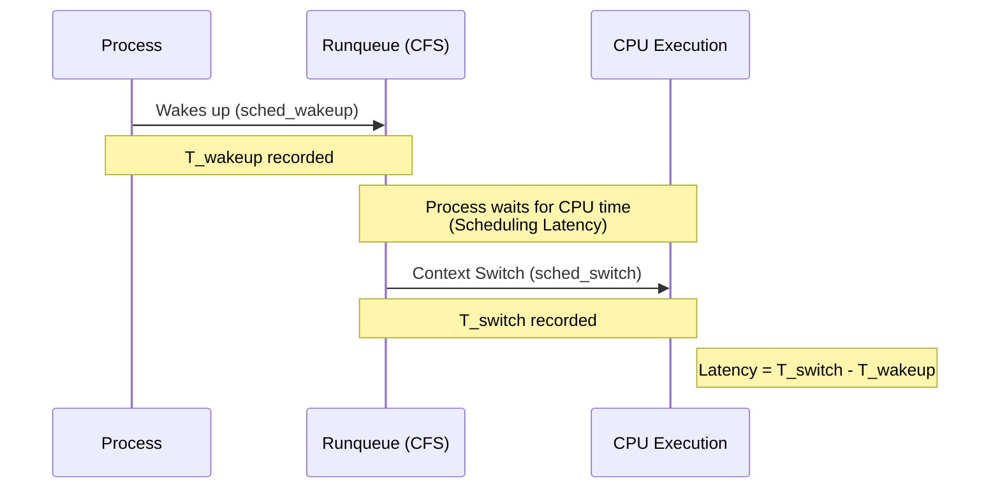
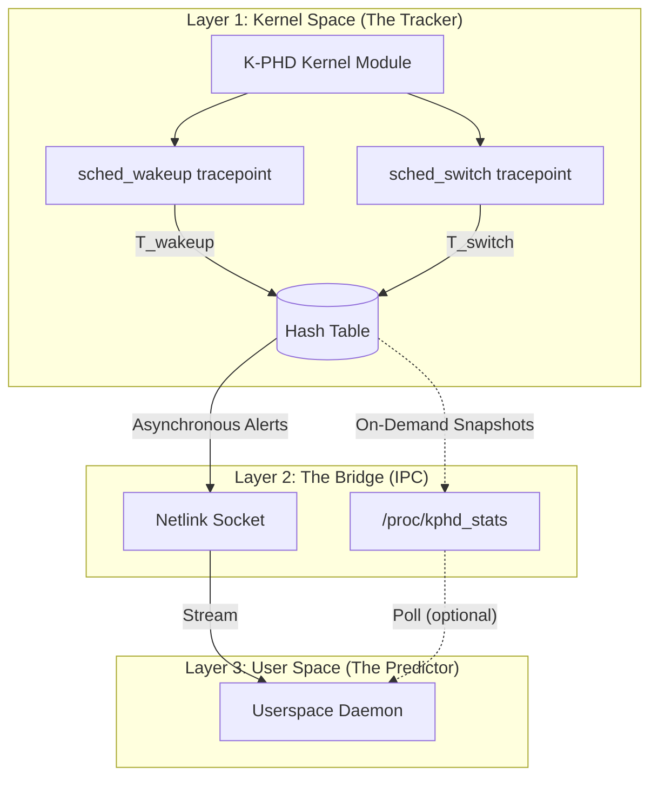

# **K-PHD: Comprehensive Technical Documentation**

## **1. System Overview**

K-PHD is a proactive, low-overhead monitoring system designed to predict application hangs before they manifest as user-visible freezes. Unlike traditional tools (`top`, `perf`) that poll system states and report post-incident metrics, K-PHD embeds itself into the Linux kernel's scheduling hot-path. It measures the exact nanosecond a process waits to be executed, streams this data to a userspace daemon, and applies statistical heuristics to flag impending CPU starvation or I/O deadlocks.

---

## **2. Theoretical Foundations**

### **2.1 The Completely Fair Scheduler (CFS)**

Linux relies on the CFS to allocate CPU time. CFS models an "ideal, precise multitasking CPU" by maintaining a Red-Black tree of runnable processes, sorted by their `vruntime` (virtual runtime).

When a process is ready to run, it is placed on the runqueue. **Scheduling Latency** is the delay between the moment a process wakes up (enters the runqueue) and the moment the CPU actually context-switches to it.

### **2.2 The Anatomy of a Hang**

Application hangs typically occur due to:

* **CPU Starvation:** A process is stuck on the runqueue because higher-priority or extremely aggressive threads are monopolizing the CPU.
* **Lock Contention / I/O Stalls:** A process enters an uninterruptible sleep state (`TASK_UNINTERRUPTIBLE`) while waiting for a hardware resource or a kernel-level lock (like a mutex or semaphore) that is not being released.

---

## **3. Architectural Deep Dive**

K-PHD is split into three distinct layers to ensure that heavy computations do not slow down the kernel.

### **3.1 Layer 1: Kernel Space (The Tracker)**

This is a Loadable Kernel Module (LKM) written in C. It is completely event-driven.

* **Tracepoints:** Instead of modifying the kernel source, K-PHD registers callback functions to pre-existing kernel tracepoints:
* `sched_wakeup`: Fires when a task is marked as runnable. We record the timestamp `T_wakeup`.
* `sched_switch`: Fires when the CPU switches from one task to another. We record `T_switch`.

* **Data Aggregation:** The module maintains a kernel-safe Hash Table mapping each Process ID (PID) to its current wait time.
* **Synchronization:** Because multiple CPU cores are context-switching simultaneously, the hash table is protected by `spinlock_t`. This ensures memory safety without putting the CPU to sleep (which is illegal inside a scheduler hook).

### **3.2 Layer 2: The Bridge (IPC)**

Moving data securely from kernel space to user space requires robust Inter-Process Communication (IPC).

* **On-Demand Snapshots (`/proc/kphd_stats`):** A custom virtual file. When read, the kernel iterates through its hash table and formats the raw latency data for user viewing.
* **Asynchronous Alerts (Netlink Sockets):** For predictive tracking, polling `/proc` is too slow. K-PHD uses a Generic Netlink socket to push lightweight binary packets containing `[PID, Latency_ns]` to userspace the moment a threshold is crossed.

### **3.3 Layer 3: User Space (The Predictor)**

A daemon (written in C++ or Python) runs in the background. It listens to the Netlink socket and performs the floating-point math that is unsafe to execute inside the kernel.

---

## **4. Predictive Heuristic Model**

To predict a hang, the userspace daemon looks for exponential latency growth. Storing massive arrays of historical data for thousands of processes is inefficient. Instead, K-PHD utilizes an **Exponential Moving Average (EMA)**.

For any given process, the smoothed latency baseline is calculated as:

$$EMA_{t} = \alpha \cdot L_{t} + (1 - \alpha) \cdot EMA_{t-1}$$

Where:

* $EMA_{t}$ is the new baseline latency.
* $L_{t}$ is the current latency measurement received from the kernel.
* $EMA_{t-1}$ is the previous baseline.
* $\alpha$ is the smoothing factor (e.g., $0.2$), dictating how heavily recent latency spikes weigh against historical performance.

**Prediction Trigger:**
If $L_{t} > (\beta \cdot EMA_{t-1})$ (where $\beta$ is a tolerance multiplier, e.g., $3.0$), the process is experiencing a statistically significant scheduling delay, and an early-warning alert is triggered.

---

## **5. Hardware Setup & Workflow Strategy**

Developing kernel modules requires strict isolation. A single memory leak in kernel space will cause a system-wide kernel panic. The development workflow heavily utilizes a dual-machine architecture to separate code generation from execution.

1. **The Dev Station (ARM64 MacBook M4):** * Use this for writing C code, managing the Git repository, and running the userspace analysis daemon.
* Establish an SSH connection to the build server. Do not attempt to compile x86_64 kernel modules natively on Apple Silicon; emulation layers interfere with exact CPU timer measurements.

2. **The Build & Test Server (x86_64 Arch Linux):**
* Use the Arch Linux machine exclusively as a hypervisor.
* Install `libvirt` and `qemu`.
* Spin up a lightweight Debian or Arch Linux Virtual Machine.
* **Crucial:** Compile and `insmod` the `kphd.ko` module *only* inside this VM. If the module crashes, only the VM halts, protecting your Arch host filesystem.

---

## **6. Development Implementation Roadmap**

The complete, detailed roadmap has been broken out into a separate document. Please refer to [`project_roadmap.md`](project_roadmap.md) for the phased approach and specific objectives.

