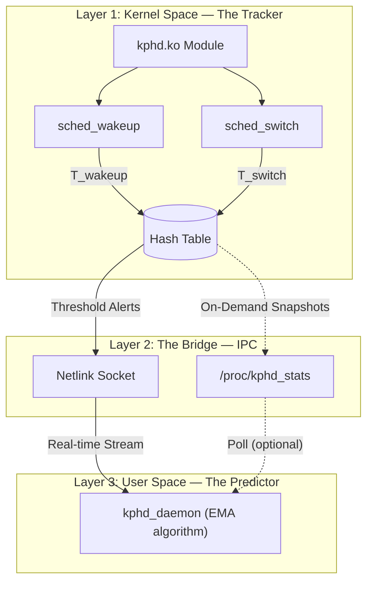

# **K-PHD: Kernel-level Predictive Hang Detector**


A proactive, low-overhead monitoring system that **predicts application hangs before they happen**. K-PHD embeds into the Linux kernel's scheduling hot-path, measures nanosecond-level process wait times, and applies statistical heuristics to flag impending CPU starvation.

---

## Quick Start


```bash
# Clone
git clone https://github.com/Atharva-Mendhulkar/K-PHD.git
cd K-PHD

# Build everything (requires kernel headers + libnl)
make

# Install system-wide
sudo make install

# Start monitoring
sudo kphd start

# View live latency data
kphd stats

# Live alert stream
sudo kphd monitor

# Stop
sudo kphd stop
```

---

## Installation

### Prerequisites

| Package | Arch Linux | Debian/Ubuntu |
|---|---|---|
| Kernel headers | `sudo pacman -S linux-headers` | `sudo apt install linux-headers-$(uname -r)` |
| libnl | `sudo pacman -S libnl` | `sudo apt install libnl-3-dev libnl-genl-3-dev` |
| Build tools | `sudo pacman -S base-devel` | `sudo apt install build-essential` |

### Build & Install

```bash
make                    # Build kernel module + daemon + tests
sudo make install       # Install to /usr/local/bin
```

### Uninstall

```bash
sudo kphd uninstall     # Remove CLI, daemon, module, systemd service
# or
sudo make uninstall
```

---

## CLI Reference

```
USAGE
  kphd <command>         Run a single command
  kphd                   Enter interactive shell

LIFECYCLE
  start         Load kernel module and start daemon
  stop          Unload module and stop daemon
  restart       Restart K-PHD (stop + start)
  status        Show current K-PHD status

MONITORING
  stats         Display color-coded latency report
  monitor       Live Netlink alert stream
  logs          Recent K-PHD kernel log messages

DEVELOPMENT
  build         Compile module, daemon, and tests
  test          Run validation suite (CPU hog + IO stall)

DEPLOYMENT
  install       Install system-wide + systemd service
  uninstall     Remove K-PHD from system

INFO
  examples      Show usage examples
  clear         Clear screen
  version       Show version
  help          Show help

INTERACTIVE SHELL
  exit / quit   Exit the interactive shell
```

### Interactive Mode

Run `kphd` with no arguments to enter an interactive shell:

```bash
$ ./kphd

  ██╗  ██╗              ██████╗  ██╗  ██╗ ██████╗
  ...

  Interactive mode. Type a command, or exit to quit.
  Commands needing root will auto-elevate with sudo.

kphd ▸ status
kphd ▸ stats
kphd ▸ test       ← auto-elevates with sudo
kphd ▸ exit
```

---

## Architecture

K-PHD is split into three layers to keep heavy computation out of the kernel:



### Layer 1: Kernel Module (`kphd.ko`)
- Registers `sched_wakeup` and `sched_switch` tracepoints
- Stores per-PID latency data in a kernel hash table (1024 buckets)
- Protected by `spin_lock_irqsave()` for multi-core safety
- Alerts pushed via Generic Netlink when latency > 1ms

### Layer 2: IPC Bridge
- **`/proc/kphd_stats`** — On-demand latency snapshots via `seq_file`
- **Netlink multicast** — Real-time alerts to subscribed daemons

### Layer 3: Userspace Daemon
- Listens on GENL family `KPHD`, multicast group `kphd_alerts`
- **EMA prediction**: `EMA_t = α · L_t + (1 - α) · EMA_{t-1}`
- Three severity levels: INFO (<2ms), WARNING (2-5ms), DANGER (>5ms)

---

## Predictive Model

K-PHD applies an **Exponential Moving Average (EMA)** to smooth latency readings:

$$EMA_{t} = \alpha \cdot L_{t} + (1 - \alpha) \cdot EMA_{t-1}$$

| Parameter | Value | Purpose |
|---|---|---|
| α (alpha) | 0.3 | How much weight recent spikes carry |
| Warning threshold | 2 ms | EMA crosses into caution zone |
| Danger threshold | 5 ms | Predicted hang — CPU starvation likely |

When the EMA for a PID exceeds the danger threshold for 3+ consecutive alerts, K-PHD predicts imminent CPU starvation.

---

## Project Structure

```
K-PHD/
├── kphd                    # CLI tool (entry point)
├── Makefile                # Top-level build system
├── kernel/
│   ├── kphd.c              # Kernel module source
│   └── Makefile             # Kernel build
├── daemon/
│   ├── kphd_daemon.c        # Netlink listener + EMA predictor
│   └── Makefile             # Daemon build
├── tests/
│   ├── cpu_hog.c            # CPU starvation stress test
│   ├── io_stall.c           # IO + lock contention test
│   ├── run_validation.sh    # End-to-end validation
│   └── Makefile             # Test build
├── Readme.md
├── project_roadmap.md
└── dev_log.md
```

---

## License

GPL v2 (required for Linux kernel modules)

---

<p align="center">
  <strong>K-PHD</strong> — Catch hangs before your users do.
</p>
